# 对github项目进行贡献

****

1. Fork 想要贡献的项目

   

2. 切换到自己的仓库目录，找到已经fork的项目，点击复制

   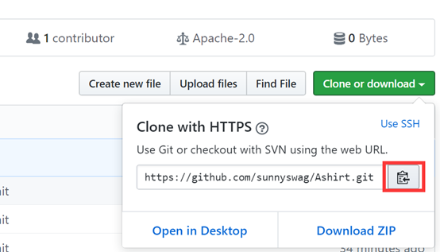

3. 在git bash(git for windows)/terminal(mac and linux)中输入```git clone <2中复制内容>```

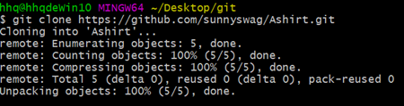

4. ```cd /path/to/your/repo```

   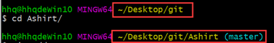

5. 添加文件

6. ```git status ``` :查看当前状态

   

7. ```git add . ``` : 添加所有修改删除的文件(注意最后有个点)

   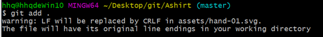

8. ```git commit -m “first_edit”``` : 将first_edit改成此次提交的说明

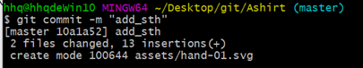

9. ```git push``` : 推送到远程仓库(github)

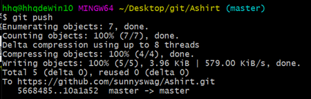

10. 刷新github页面(你所fork的项目)

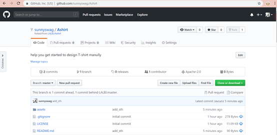

11. 填写pull request对项目发送贡献请求

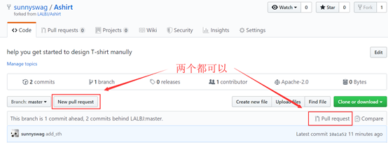

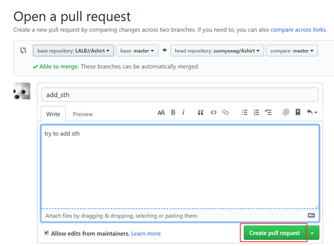

# 和主项目保持同步

****

### 方式一(云端同步):

1. 重新点击 pull request 
2. 将 pull request 路径调整成从被 fork 的项目到 fork 的项目

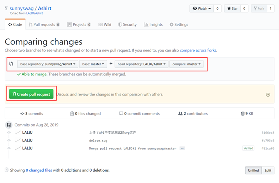

3. 点击 create pull request 完成同步

### 方式二(本地同步)

1. ```git remote add upstream <被fork的项目>```  : 本地添加远程主分支，叫upstream。可以先```git branch -a```查看是否已添加远程分支，若已添加，此步骤忽略

   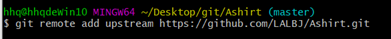

2. ```git fetch upstream```  :获取主分支的最新修改到本地(在此之前本地是没有云端分支的)

   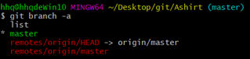

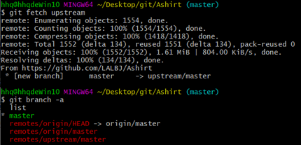

3. ```git merge upstream/master```  : 将upstream分支修改内容merge到本地个人分支

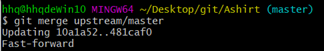

4. ```git push```


# 日常使用命令

****

##### Normal :

```git status``` : 查看当前状态

```git add <file>``` : 添加文件

```git add ./git add -A``` : 添加所有文件

```git commit -m “[commit message]” ``` : 提交修改

```git rm -r <file>``` : 删除文件或目录

```git push``` : 推送master分支至远程仓库

```git log``` : 查看修改的版本信息

##### Advanced 

```git push -u origin [branch name]``` 推送一个分支到远程仓库

```git branch -a``` 列出所有分支

```git branch [branch name]``` 添加新分支

```git checkout [branch name]``` 进入新分支

```git merge [source branch]/[target branch]```  合并分支

```git push origin --delete [branch name]``` 删除远端分支

# Other tips 

```git reset <file>``` : 撤回git add . 所添加的文件

```git reset --hard HEAD~1``` : 清除最近的commit

```git reset --soft HEAD~1``` : 清除commit但不清除你所做的任务

# 参考链接

[Git-Commands](<https://github.com/joshnh/Git-Commands>)

[github上fork一个分支，如何和主分支同步](<http://eleaction01.spaces.eepw.com.cn/articles/article/item/164762?tdsourcetag=s_pctim_aiomsg>)